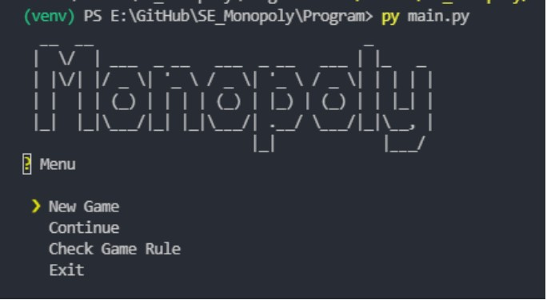

# SE_Monopoly In Terminal

&nbsp;

## Documentation
Overview Doc: [Link](Doc/Q1.pdf) 
Design Doc: [Link](Doc/SE%20Q2%20API%20Document.pdf) 
Dev Menu: [Link](Doc/SE%20Q4%20DevManual%20Document.pdf) 
User Menu: [Link](Doc/SE%20Q4%20UserManual%20Document.pdf) 

## Screenshots

  
